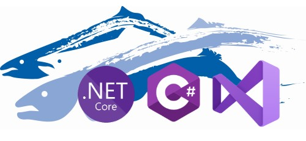
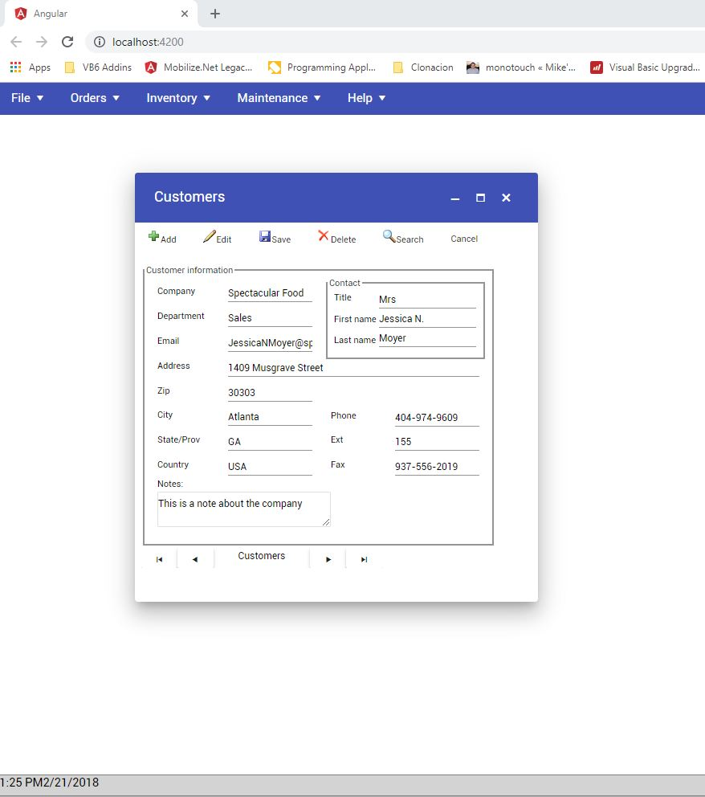

# Salmon King Seafood Reference App (SKS) WinForms C#



# About the App
Salmon King Seafood (SKS) is a reference App create to show some of the migration capabilities of the our [WebMap product](https://www.mobilize.net/webmap)

This app was originally develop in Visual Basic 6 (VB6).

The **VB6 source code** of this app can be found [here](https://github.com/MobilizeNet/SKSVB6)

The **VB6 source code** was upgraded to a C# Windows Forms Desktop app using the [Visual Basic Upgrade Companion tool](https://www.mobilize.net/visual-basic-upgrade-companion).

The **C# Windows Forms source code** of this app can be found [here](https://github.com/MobilizeNet/SKSWinForms)

The **C# Windows Forms source code** was upgraded to an [Asp .Net Core](https://dotnet.microsoft.com/learn/aspnet/what-is-aspnet-core) App using our [WebMap product](https://www.mobilize.net/webmap)

> NOTE: This app was migrated to .NET Core 2.2. If you haven't installed it just go to: https://dotnet.microsoft.com/download/dotnet-core/2.2


# Understanding the target code

[Mobilize.Net](https://www.mobilize.net/)'s [WebMap product](https://www.mobilize.net/) upgrades WinForms desktop apps to a modern Asp.Net Core applications. 

Those applications will have a:
* C# BackEnd
* Angular 8 TypeScript FrontEnd


# FrontEnd Code

The WinForms screens are converted to an angular application.
Each of the Forms or UserControls are converted into angular components.

The following is an example of the angular components structure for the SKS.

```
- sks-angular
    - src
        - app
            - components
                - sks
                    - frm-about
                    - frm-action-order-reception
                    - frm-action-order-request
                    - frm-add-product-to
                    - frm-adjust-stock-manual
                    - frm-customers
                    - frm-login
                    - frm-main
                    - frm-order-request
                    - frm-products
                    - frm-providers
                    - frm-reception-approval
                    - frm-request-approval
                    - frm-splash
                    - frm-users-manage
```                    
## Building front end code

Building front end code is simple:

First make sure you have the angular client installed.
If it is not installed, install angular CLI (Command Line Interface) using `yarn`  or `npm` install

```
npm install @angular/cli -g
```
Then from the command line switch to angular source code folder:
```
cd sks-angular
```
Install dependencies using 
```
yarn install
```
or 
```
npm install
```

And build the source code using:
```
ng build
```

## Serving the code

For angular, it is very common to use `ng serve`. This command will
builds and serve your app, rebuilding on file changes.

It will use the `proxy.conf.json` file to redirect backend calls. By default `ng serve` starts in `http:\\localhost:4200` and the provided `proxy.conf.json` file expects the backend on `http:\\localhost:5000`

# Building the Backend Code

Just open your code in Visual Studio 2017 or 2019 and compile your code. You can also compiled from the command line using:

```
dotnet build
```

> **NOTE:** Remember to compile the frontend or starting the `ng serve` version before starting the application.

One the application is compiled just start the debugger.

or run it using

```
dotnet run
```

You should now see a screen like:


